# 2026-10-09: Finished the input stage schematic

**Total time spent: 1.5 hours**

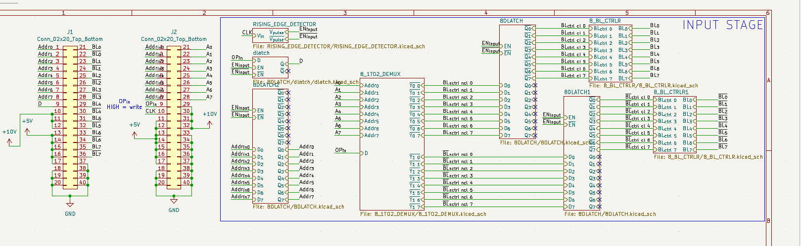
The finished schematic for the input stage
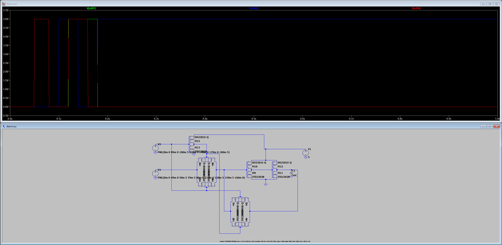
Simulation of a single d-latch. Green is Q, blue is EN, and red is D
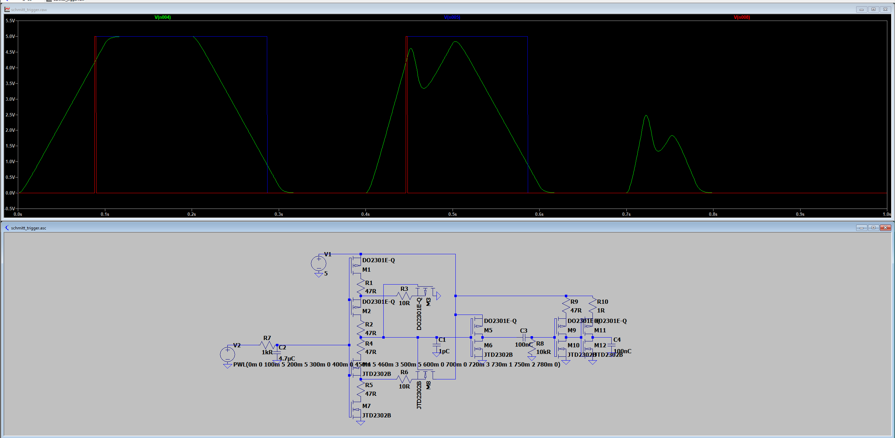
Simulation of a Schmitt trigger. Green is the messy, noisy input signal, blue is after the Schmitt trigger, and red is the edge detector 2ms pulse.
# What I did
I finished the schematic for just the input stage! The two things I made were the d-latches and the rising edge detector/Schmitt trigger. I simulated both because both of them can be kind of finicky. 

It's good I simulated the Schmitt trigger because all the designs online are for ICs and basically assume that all the mosfets have high resistance, but since I'm using low resistance discrete mosfets, the "standard" Schmitt trigger circuit would cause a 30 amp short between VCC and GND every switch. I fixed this by adding some resistors. I had to do a lot of tuning (mostly because I've never worked with Schmitt triggers before) but I'm now able to control the threshold voltages by modifying two resistors (the two 27 ohm ones in the picture) and I've removed the huge short circuits.

I also simulated the D-latch but there weren't any circuit issues (I do have to put two back-to-back mosfets again like in the main SRAM cell because my mosfets will have body diodes) and you can see the simulation in the picture above.

I wired everything up and I'm going to work on the schematic for the RAM stage next (I'll do all the PCBs last).

# Lapse link
https://lapse.hackclub.com/timelapse/8shvfVoj0mrP

# 2026-10-08: Started the main controller board!

**Total time spent: 2.5 hours**

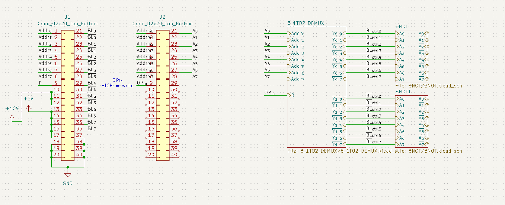
The progress I've made on the main schematic (not very much)
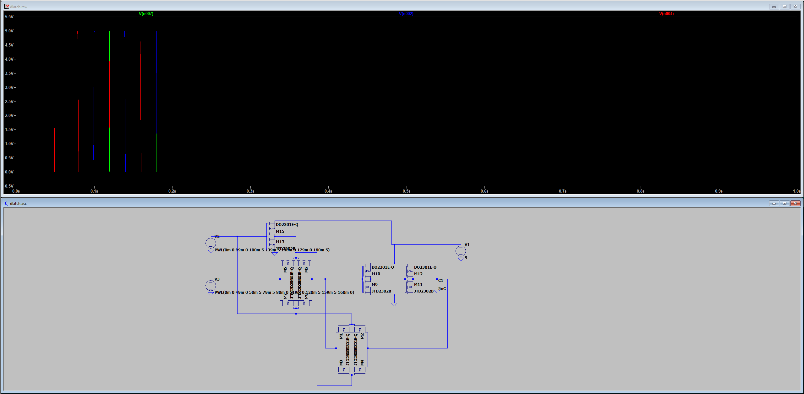
Simulation I made of a D-latch

# What I did
Today, I began work on the main controller board. It's harder than I thought and I'm still struggling to wrap my head around everything that needs to be done. I've barely done the processing part of the input stage and not even the d latch yet. Here's what I've come up with

## What the main controller board does
The main controller board is given an 8-bit address, 8-bit data (optional), and a command. If the command is a write, it will write the data to the address. Regardless, the RAM will read whatever data is at the address (the new data if its after a write) and output that.
The hard part here is timing. Every signal needs to have a clearly defined time when it is valid. Because the RAM array doesn't have any built in timing, the RAM board needs to handle that. Here's how I decided the RAM controller will work:
## How I'm going to design the RAM board
The ram board will be composed of 3 separate timing stages: the input stage, the ram stage, and the output stage.
The ram board will take all input on a RISING clock edge and output on the next FALLING clock edge.
### Input stage
The input stage processes the input and outputs at the correct time and in a correct state to the ram stage. The input stage takes the current input (address, data, and command) and process that into BL commands (pull up or down) and WL address commands. The BL and WL commands are fed into a D-latch. A rising edge detector detects the rising edge and sends a pulse to the EN input of the D-latch, which passes the bit line commands and the WL commands into the RAM stage. The input stage also sends a pulse to the RAM stage to signal it.
### RAM stage
The ram stage only has 1 job: make sure the BL is correct before enabling the WL. The RAM stage always applies whatever BL commands it gets from the input stage irrespective of the clock because the input stage already guarantees BL commands are synchronized. Upon receiving the signal pulse, a circuit will delay the pulse then extend it to 20-30 ms. The extended pulse is the WL signal, which is delayed to ensure the BL commands have been applied before enabling the WL.
Finally, the RAM stage sends the WL pulse to the output stage.
### Output stage
The job of the output stage is to read the RAM at the correct type and output clock-synchronized read. The raw bit lines from the ram array are fed into a circuit which processes the BLs into data. This data is fed into ANOTHER d-latch reads it after a delay from the rising edge of the WL pulse. This ensures that the BLs have time to settle AND the WL is still enabled when read. Finally, the output from the d-latch is fed into another d-latch that is controlled by the clock to clock-synchronize it.

---

Okay. That was a lot and I'm sure I made lots of mistakes which is why I'm working on simulating it. But hopefully that will work.

Today, all I did was start with the input stage processing. This board is by far the most complex for sure though.

# Lapse links
https://lapse.hackclub.com/timelapse/HK0Go3kwnsZ8
https://lapse.hackclub.com/timelapse/240UbDXo5Uvz
https://lapse.hackclub.com/timelapse/HlwZQAF2P8GN

# 2026-10-07: Designed the main demux board!

**Total time spent: 2 hours**

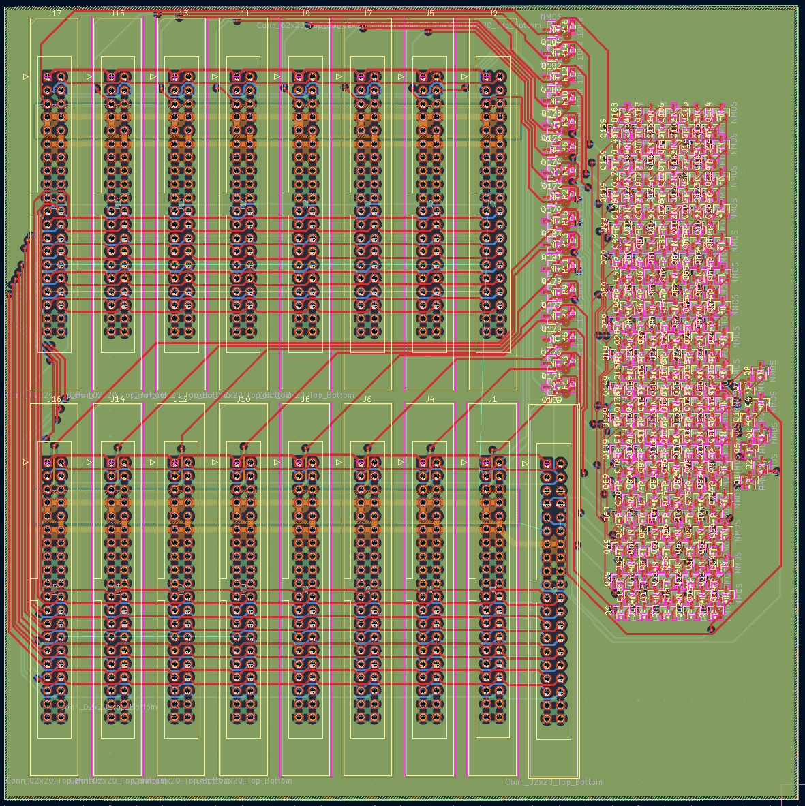
The completed PCB
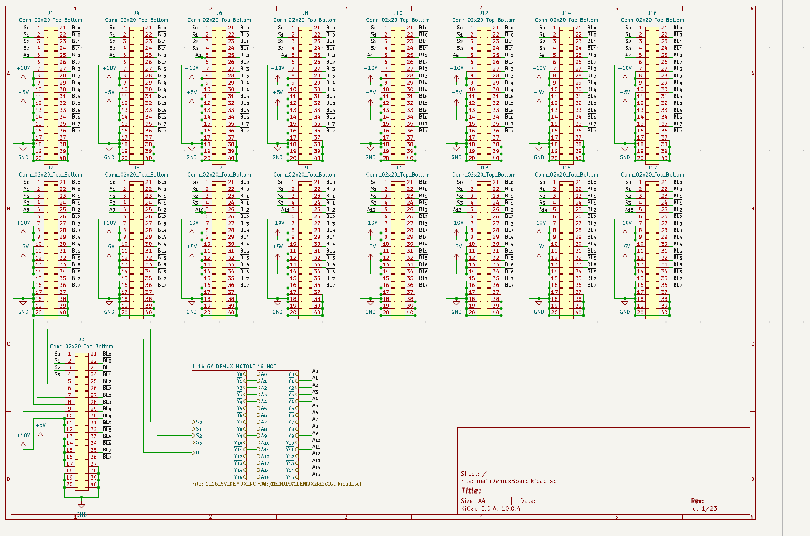
The schematic

# What I did

Today, I finished designing the schematic for the main demux board (I started in a previous devlog but didn't talk about it). The main demux board basically converts the 16 ram boards into one large 256x8 array by demuxing the most significant 4 bits and enabling only the WL on the correct board. The board itself was really simple, just 16 connectors for the ram boards and 1 connector for the external connection to the controller board. The only logic on it is about 200 transistors for the 1:16 demux which I just copy/pasted from the main RAM board.

I didn't simulate this board because the logic is dead simple and copy/pasted from the previous board, so if that one works this one should work too (though I actually havent simulated the demux in that one yet so I'll do that probably next devlog, hopefully I don't find any issues).

I'm planning on manual assembly for this board because one, I only have to assemble one board of 200 transistors so that's only a few hours, and two, it basically doubles the price of the boards if I get them assembled. There really isn't much more to say, but now I have to start to work on the actual hard part of the project, the RAM controller board.

# Lapse links
https://lapse.hackclub.com/timelapse/sfn6wTg3hgO3 
https://lapse.hackclub.com/timelapse/YwO8DZddrAsB 
https://lapse.hackclub.com/timelapse/HZtLlioMd9gv 

# 2026-10-06: Added LEDs to the board!

**Total time spent: 3 hours**

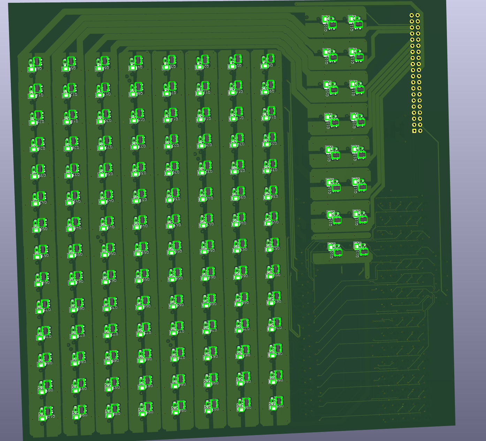
The new back of the PCB with the LEDs
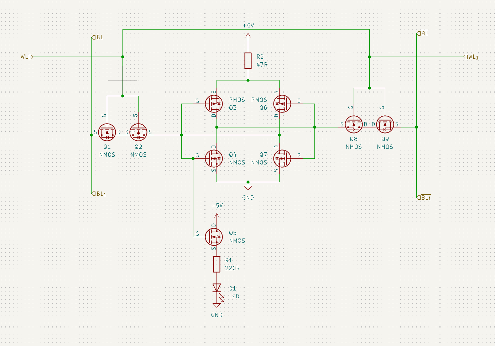
The new schematic.

# What I did

I added the resistors I talked about earlier. I stuffed them in the corner of the cell and miraculously, there weren't any important DRC errors!

I also added the LEDs to the cells. I would have really liked to be able to directly put LEDs on it, but that would draw too much current so I instead put another mosfet to control the LED which will not draw any extra current. This adds 3 extra components per cell (mosfet, resistor, and LED), but I'm not too concerned because it is totally optional and you can just not put LEDs at all and it will still work.

Of course, I simulated this in LTspice just to be sure it will still work and it looks fine. I also added some decoupling capacitors because you do not want the voltage supply sagging every time the transistors switch.

I also tried getting a quote for JLC pcb assembly, and it is **expensive**. It cost around $400, but $250 comes from the board and the components, so the assembly cost about $150. If I ever do try building this, I think the only option is assembly because I don't want to solder 28 000 components by hand (even with solder paste and hot plate, that will take like 50 hours). 

## Figured out what all those weird transients are from

Earlier, I noticed that my circuit was drawing large current transients on certain clock cycles. Well, I finally figured out why. So basically my bit lines are fed from a LTspice variable voltage source which I set to have a 1ms rise time. To ensure that the BL signals were sharp, I fed it through two inverters (also to test the characteristics of my inverters). Now, this was successful at producing very, very sharp edges (see image below) BUT I totally forgot since the actual signal fed into the first inverter was (comparatively) slow at rising AND the inverter was not fed by a line with a resistor, significant time was spent in the linear region of both transistors, causing a dead short.

I think this can be fixed by just putting a small resistor before the CMOS power, but I need to do more research/simulation because that can cause the CMOS inverter's voltage supply to sag, which can cause issues.

Stages of my two inverter setup. Green, blue and red are the input signal, output after 1 inverter, and output after 2 inverter signals respectively. Notice how the blue signal is sharper but still pretty distorted while the red signal is lightning fast.

# Lapse links

https://lapse.hackclub.com/timelapse/rngF5m_neMcB 
https://lapse.hackclub.com/timelapse/9JZD9-N2Nd2J 
https://lapse.hackclub.com/timelapse/2NOMcpykwXSq

# 2026-10-04: Did some more simulation and found parasitic resistance issues

**Total time spent: 1.5 hours**

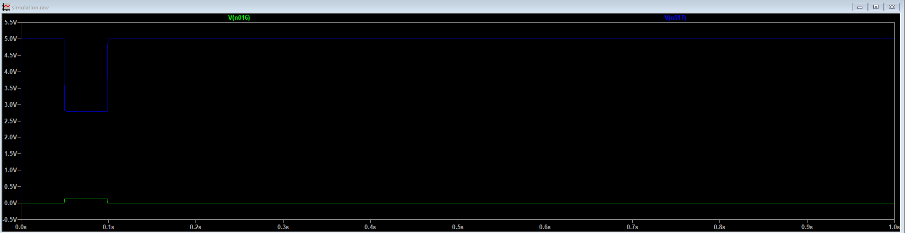
Parasitic resistance issues are fun! /s

# What I did

I ran a bunch more simulations on the single SRAM cell and added in parasitic effects. Previously I ignored parasitic capacitance and inductance because my clock speed is so s l o w, 10Hz. This is correct, but for some reason I totally forgot about the parasitic resistance in long PCB traces and connectors (especially between the boards).

# I hate parasitic resistance

Parasitic resistance is the unavoidable resistance in PCB traces, connectors, and everything in between. I thought that a few tens of milliohms would not make a difference and just ignored it earlier, but it turns out that adding just ten milliohms of resistance to the bit lines can cause write failures and strong current transients (tens of amps for a whole clock cycle). This is horrible news because even if I made traces wider (which I'll do anyway cause its good to lower resistance), the resistance from controller board to end of BL will easily be over 10 mOhms.

The reason that resistances on the bit line causes write failures is because to flip the cell, one side must be pulled <b>HARD</b> to LOW, hard enough to overcome the PMOS pull-up. Now, because the current flows from VCC to PMOS though the two back to back NMOSs and then through the array of parallel NMOSs, the cell gate voltage is determined by a voltage divider, specifically `V_g = (R_access + R_blpulldown) / (R_pmos + R_access + R_blpulldown) * Vcc`. This `V_g` must be low enough that the cell flips, which is when the NMOS overpowers the PMOS. In my case, it was about 2v-3v. It just so happened that because of my specific resistances, the system was basically balanced on a knife's edge. `R_blpulldown` was about 10mOhms, `R_access` about 80mOhms, and `R_pmos` about 120mOhms. This gives a voltage of 2.1v which is right at the edge of what will produce a valid write. Remember, the transistors won't be perfect too so even without the parasitic resistance many of the cells would likely fail. With 10mOhms of extra `R_blpulldown` resistance, `V_g` would be about 2.3v, causing the write to fail.

# The fix 
I tinkered around with the circuit for a good hour or so and finally have come up with probably the best solution in my case. If you read the previous paragraph, you might have noticed that the only way to reduce the voltage is to reduce `R_blpulldown` and/or `R_access`, which is impossible OR increase `R_pmos`. I found adding a large resistance in series with the p mosfets completely solved the issue. This can cause some read instability so I tested it a lot but I really didn't find anything.

Additionally, I found that I could get away with only using one 47 ohm resistor per cell instead of two by having both PMOSs share the resistor. This can cause some issues with voltage sag, but I didn't see any. This really does matter because even 1 component per cell saves 2048 components overall. Still, I need to find a way to fit one more resistor on each cell which is already packed super full, so that will be a challenge. I don't want to make the cell bigger because then I'll have to basically re route the whole board again which will take like 4 hours.

# Lapse link & time
About 1.5 hours (I'm just going off of my hackatime total and subtracting how much I already have)
https://lapse.hackclub.com/timelapse/Vni9q50XzASu

# 2026-10-04: Fixed the level-shifter issue!

**Total time spent: 1.5 hours**

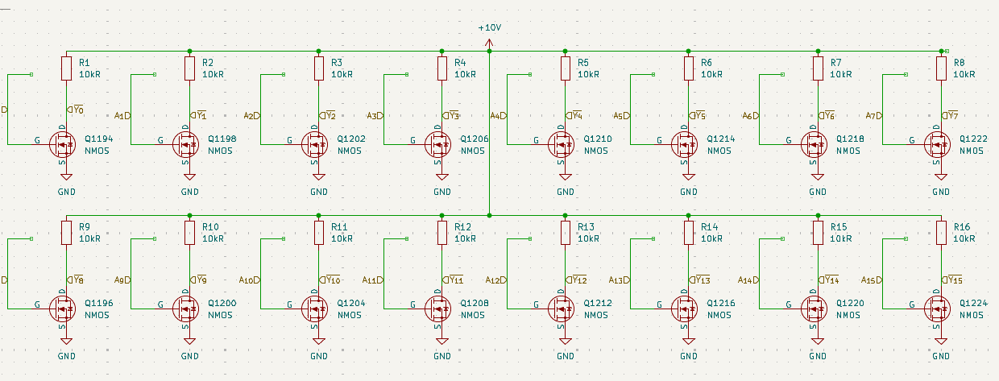
<small>New schematic, notice the pmos has been replaced by simple pull-up resistors</small>
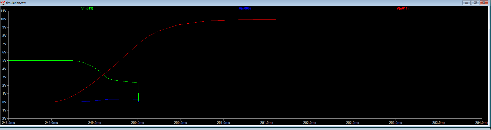
<small>Small time step of simulation, green is Q, blue is ~BL, red is WL. Notice that its now slower  because of the pull up resistor/parasitic capacitance.</small>

# What I did
I replaced the PMOS pull up mosfets in the level shifter with pull up resistors. Previously the level shifter would work fine on a LOW signal (PMOS gate at -10v so ON and NMOS gate at 0v so OFF) but fail on a 5v HIGH signal (PMOS gate at -5v so ON and NMOS gate at 5v so ON). On a 5v HIGH signal, there would be a huge short-circuit current through the PMOS and NMOS (upwards of 30A in the simulation). The fix here I choose is to forget complicated CMOS logic and just replace the PMOS pull-up with a 10k ohm resistor. The advantage is the incredible simplicity and smaller footprint (I don't know how I would fix another like 5 transistors per WL in that area). The main disadvantage is that it causes the WL to take one or two milliseconds longer to rise, but that's totally unimportant here because the max clock speed this is designed for will be 10Hz (100ms / clock cycle).

## Other PCB stuff
Here's the new part of the PCB with the pull-up resistors.
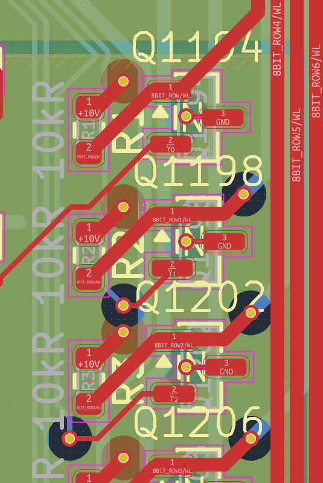

I also added the 2x20 IDC header for connecting the boards together.
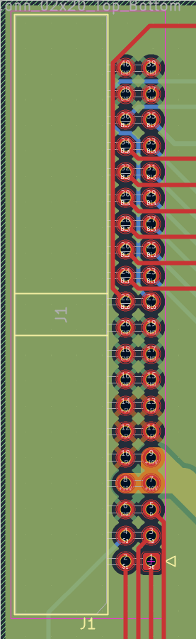

# Lapse link & time:

I spent some time working on it when I didn't realised it was paused, ~30mins. I did some more simulation (you can see the jump at around the 13 second mark in lapse)

https://lapse.hackclub.com/timelapse/vyfiN1gcHwnZ

# 2026-10-04: Ran some simulations and started design for main board!

**Total time spent: 7 hours**
<figure>
 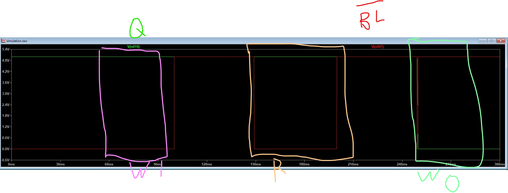
 <figcaption>Final simulation results! Explanation of this below.</figcaption>
</figure>
<figure>
 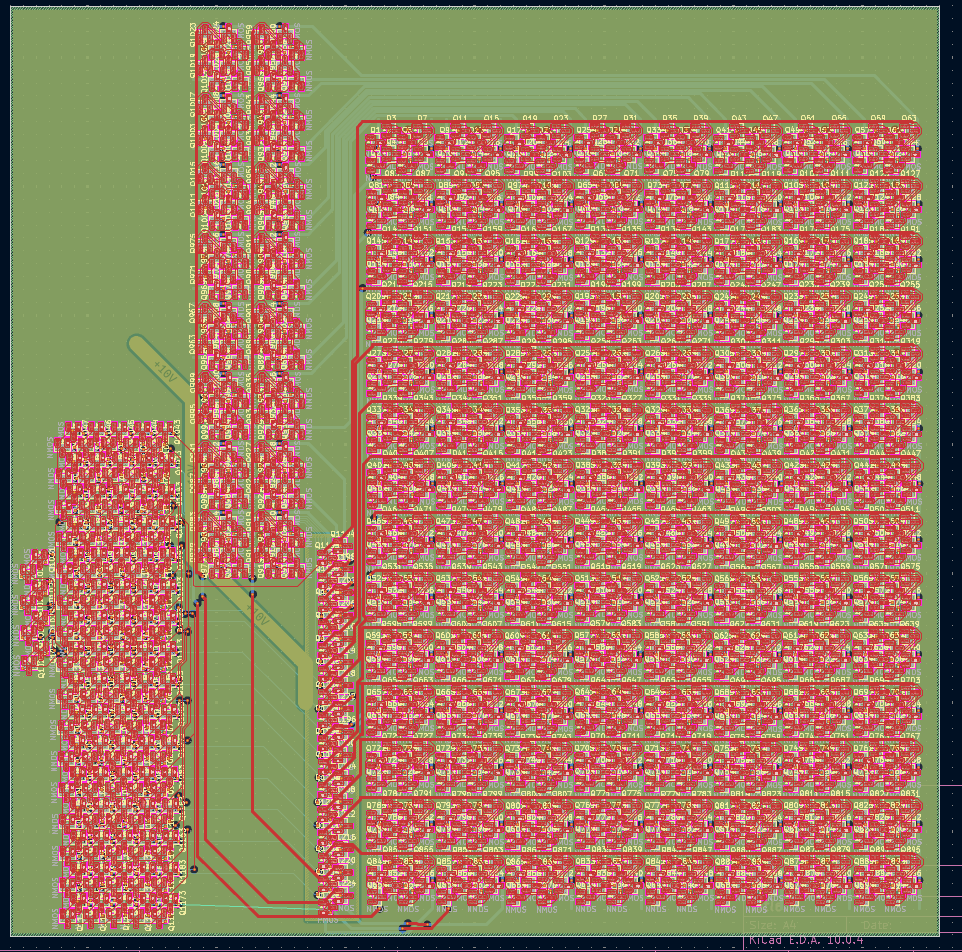
 <figcaption>My PCB layout! Explanation below too.</figcaption>
</figure>

# What I did
## Simulating
I started simulating a single SRAM cell to make sure that the resistances were properly matched and I wouldn't get a read failure, write failure, or any crazy transients. Initially, I had some really bad transient current spikes on a read operation, but that was because I was improperly pulling up the bit lines. Then I had to debug a ton of write failures due to the bit line pull-downs being to weak. I fixed that by putting 3 transistors in parallel to pull the bit lines down hard, but I'll probably use like 5 to make sure that it works in the main design (I'll simulate it too).

## PCB
I designed out the main board PCB and the schematic. There are (as expected) a ton of DRC errors so I need to fix those. The main board PCB is actually the easiest part of this because its extremely repetitive. I used [Project Instances](https://github.com/OfficialDyray/ProjectInstances/) and hierarchical schematics in KiCad to repeat the same block over and over. As I was writing this I just realized there is a huge issue with the logic level inverter, so I'm going to fix that first.

# PCB explanation

The PCB has 3 main parts: The main SRAM bank, the 1:16 demultiplexer, and the logic level shifter/NOT gate. The SRAM bank is the huge grid in the bottom right corner along with the two columns in the middle of the left side. It's really just one cell repeated 128 times (if you zoom in you can see the single 8 transistor cell). The demultiplexer is the block of transistors on the left side. The demultiplexer is basically a few not gates (left side) and 16 5 way NAND gates (right side). It isn't like a "true" demultiplexer because it outputs NOT of whatever it should be. This is really useful because it can easily be fed into a logic level shifter / inverter to output the correct signal at 10v. The logic level shifter / inverter is the small column of transistors in the middle. Now right now, it won't work (just realized that), but I'm going to fix that soon.

# Explanation of that really cool image of the simulation results

The image of the simulation shows the current bit the cell is storing (Q) and the not bit line (~BL). Upon startup, Q is initially high (in real life, it will be random, I may or may not decide to change that).
## Writing HIGH
The first operation is to write HIGH. To do this, both bit lines are weakly pulled HIGH and the bit line that should be low is strongly pulled LOW. Here, ~BL is LOW because ~HIGH = LOW. Then WL is pulled HIGH, opening the access transistors. Since the cell is already in the same state, nothing happens.
## Reading
The second operation is to read. To read, both bit lines are again weakly pulled HIGH and the WL then pulled HIGH. Since the bit lines are weakly HIGH, the side of the cell that is strong LOW will pull the bitline almost all the way to LOW. Here, since the cell is HIGH, ~Q = LOW, and ~BL is pulled LOW, which you can see. This can easily be read and converted to a signal.
## Writing LOW
To write LOW, the same procedure in writing HIGH is followed. This time, ~BL is HIGH and BL is LOW. As you can see, the cell immediately flips as soon as WL is HIGH (WL not shown).

## A note about transient current events
Each write where the cell is flipped causes a very short transient current event. This is because current shoots through the pull up PMOS in the cell, through the access NMOS transistors, and through the bit line pull down NMOSs. Hopefully it won't be an issue because its only about 12 amps and only lasts until the cell flips, which in the simulation was 200-300 us.

# Lapse links:
The lapse videos are sram 1 through sram 7 here (yes i accidently put two sram 6s, they are different) https://lapse.hackclub.com/user/@tiydwe

